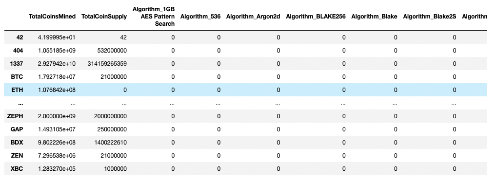
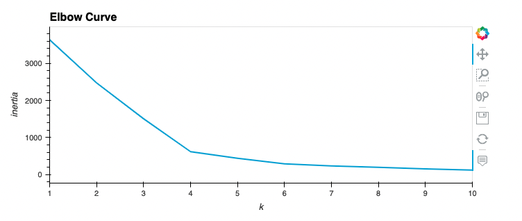
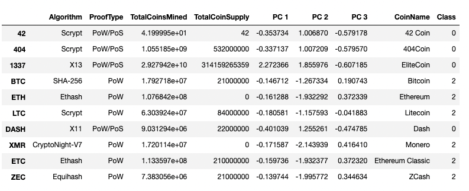
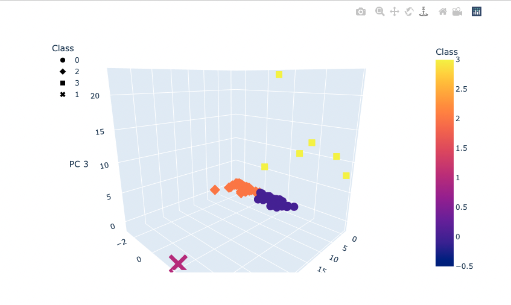
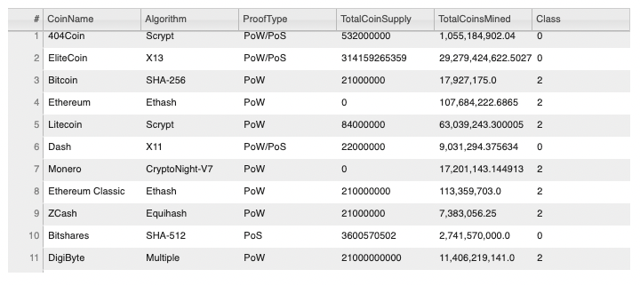
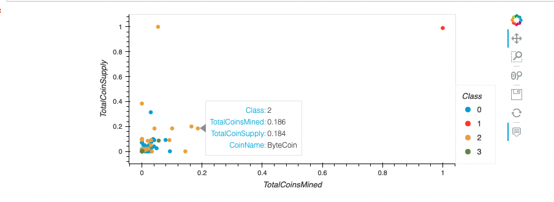

# Cryptocurrencies
Module 19 - Cryptocurrencies - Unsupervised Machine Learning

Using unsupervised machine learning we analyze a data set of crypto curriencies. First to identify the trading currencies with mining. Then running models on the data to form culters and grouping of crypto currencies. 

Below are a number of screen shoots from the process. 

## Part 1: Preprocessing the Data for PCA

## Part 2: Reducing Data Dimensions Using PCA

## Part 3: Clustering Cryptocurrencies Using K-means

## Part 4: Visualizing Cryptocurrencies Results

